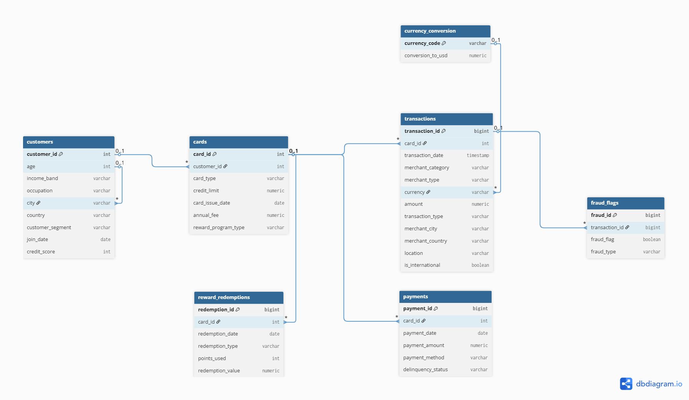

# SQL--Credit-Card-Portfolio-Analytics
End-to-end Python + SQL + Power BI case study analyzing credit card portfolio: spend behavior, fraud risk, rewards, profitability


## Executive Summary
This project builds a SQL-driven analytics system to monitor and optimize the credit card portfolio for **XYZ Bank** (UAE HQ, operating across 7 countries). It analyzes spend behavior, channel and timing patterns, segment contribution, fraud (frequency vs value), rewards effectiveness, and profitability—then converts findings into clear business actions.

### Portfolio snapshot (from this project)
| Metric | Value |
|---|---|
| Customers (unique) | **10,000** |
| Cards issued | **51,598** |
| Total Spend (USD) | **$508.31M** |
| Avg Monthly Spend (USD) | **$21.18M** |
| Time Window | **Jan 2024 → Dec 2025** |
| Fraud Rate (overall) | **0.257%** |
| Geographies | **India, UAE, UK, Europe, Turkey, Qatar** |

---

## Business Problem
Banks need reliable portfolio insights to make data-driven decisions on:
- **Revenue growth** (category strategy, channel strategy, campaign timing).
- **Risk reduction** (fraud concentration by segment/category/channel; minimizing customer friction).
- **Rewards economics** (cashback cost control; value-based rewards).
- **Profitability & retention** (protect high-value cohorts; manage loss-making customers).

---

## What’s Included
### Report pages (Markdown)
- [`01_Executive_Summary.md`](01_Executive_Summary.md)
- [`02_Business_Context.md`](02_Business_Context.md)
- [`03_Data_Model.md`](03_Data_Model.md)
- [`04_Business_Insights_Report.md`](04_Business_Insights_Report.md)
- [`05_Results_and_Recommendations.md`](05_Results_and_Recommendations.md)
- [`06_Next_Steps.md`](06_Next_Steps.md)

### Data documentation and outputs
- Data dictionary / output index: [`data/README.md`](data/README.md)
- Sample SQL output screenshots: [`data/sample_outputs/`](data/sample_outputs/)

---

## Data Visualization
### Power BI dashboard preview (5 pages)
**Portfolio Overview**


**Spend & Channels**


**Rewards & Profitability**


**Fraud & Risk**


**Segments & Customers**


---

## Methodology
1. **Synthetic data generation (Python):** Multi-country portfolio behavior with realistic patterns (categories, channels, weekend bias, fraud injection, rewards redemptions).
2. **Database design (PostgreSQL):** Normalized schema and analytics-ready structure.
3. **Data validation (SQL):** Sanity checks (duplicates, missing values, referential integrity, fraud rate checks).
4. **Analytics layer (SQL):** Summary outputs for spend, segmentation, Pareto concentration, fraud, rewards, and profitability.
5. **Visualization (Power BI):** Dashboard built on validated SQL outputs + documentation in Markdown.

### Data model (ER diagram)


---

## Skills
- **SQL:** CTEs, window functions, percentiles, aggregations, CTAS
- **PostgreSQL:** schema design and relational modeling
- **Python:** synthetic data generation
- **Power BI:** dashboarding and insight communication
- **Business analytics:** segmentation, Pareto analysis, fraud and rewards economics, profitability analysis

---

## Results & Business Recommendation
### Results (high level)
- Spend is concentrated in everyday categories (largest pools: **Groceries, Shopping, Fuel**).
- Channel behavior shows a **digital-first portfolio by spend value** (online spend dominates).
- Spend is strongly **weekend-skewed**, making timing a key lever.
- Spend concentration is meaningful: **Top 20% customers contribute 57% of total spend**.
- Fraud differs by segment in **frequency vs value**, requiring segmented controls.
- Cashback dominates reward redemptions, making it the primary cost lever.

### Business recommendations (high level)
- Growth: prioritize top spend categories, execute digital-first, and schedule major campaigns around weekends.
- Segments: apply segment-led strategy (Emerging Affluent retention/upsell; Mass Market scale + stable digital experience; Low Value activation + automation-first risk).
- Fraud: separate controls for frequent fraud pockets vs high-severity exposure, while minimizing friction for top spenders.
- Rewards: move toward value-based tiering/thresholds and monitor reward-to-spend patterns to reduce leakage.

Full details: [`05_Results_and_Recommendations.md`](05_Results_and_Recommendations.md)

---

## Next Steps
A simple execution checklist to move from recommendations to implementation is captured here:
- [`06_Next_Steps.md`](06_Next_Steps.md)

---

## Sample Outputs Available
Sample SQL outputs (screenshots) available in: [`data/sample_outputs/`](data/sample_outputs/)

- `cuatomer_spend_summary`
- `segment_spend_summary`
- `monthly_spend_summary`
- `category_spend_summary`
- `online_vs_offline`
- `weekend_vs_weekday`
- `fraud_summary`
- `fraud_by_segment`
- `pareto_spend_analysis`
- `pareto_customer_revenue`
- `rewards_effectiveness`
- `rewards_avg_redemption`
- `rewards_summary`
- `customer_profitability`
- `profitability_summary`
- `customer_segmentation`

---

## How to Navigate
Recommended reading order:
1. [`01_Executive_Summary.md`](01_Executive_Summary.md)
2. [`02_Business_Context.md`](02_Business_Context.md)
3. [`03_Data_Model.md`](03_Data_Model.md)
4. [`04_Business_Insights_Report.md`](04_Business_Insights_Report.md)
5. [`05_Results_and_Recommendations.md`](05_Results_and_Recommendations.md)
6. [`06_Next_Steps.md`](06_Next_Steps.md)

Supporting references:
- [`data/README.md`](data/README.md)
- [`data/sample_outputs/`](data/sample_outputs/)

---

## Repository Structure (high level)
```text
.
├── 01_Executive_Summary.md
├── 02_Business_Context.md
├── 03_Data_Model.md
├── 04_Business_Insights_Report.md
├── 05_Results_and_Recommendations.md
├── 06_Next_Steps.md
├── data/
│   ├── README.md
│   └── sample_outputs/
├── images/
├── sql/
├── python/
└── PowerBI/
